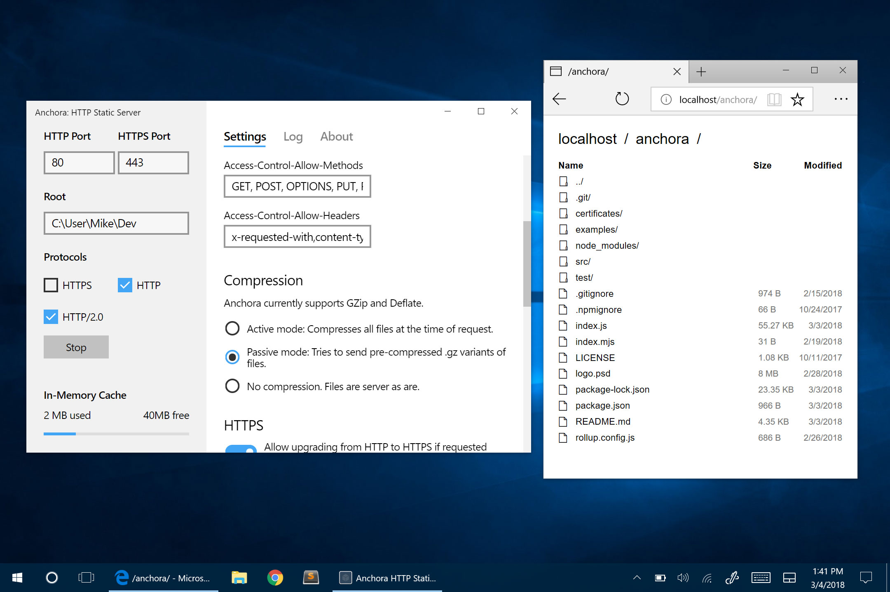

# Anchora App: HTTP/2.0 Static Server for Windows 10

👨‍💻 Localhost has never been sexier. Simple yet powerful static server app for Windows

  

## What is it?

The first HTTP static server app to be released in Windows Store. Oh and it's also the most fun to use, the easiest, the most beautiful, ... you get the point.

A Lightweight alternative to bulky bundles like XAMPP, WampServer and an effortless alternative to Apache server. Those tools are usually out of date (*try using .mjs extension in chrome*), require admin priviledges and come with a lot of baggage (*phpmyadmin, mysql, perl, etc...*) when all you sometime need is a simple way to host files.

Besides it's pretty face sits powerfull [Anchora Egine](https://github.com/MikeKovarik/anchora) (*available as an npm module [`anchora`](https://www.npmjs.com/package/anchora)*). Hybrid of HTTP1 and HTTP/2.0 with implementation of HTTP2 Push streams. Configured to be blazing fast and utilitarian, thanks to caching on both ends, generating self-signed HTTP certificates, CORS, and more. NO need to configure anything. NO htacces files. NO nothing. Effortless. It just works, out of the box. Yeah, that's right. This puppy does 0 to 60mph in 300 milliseconds. Comparable if not faster than Apache!

## Current state

About to be released to the Windows Store. Soon (tm) :D. To select testers first.

Most of the work lies in the engine's repository which is pretty much feature locked and stable. Only needs a few more touches here and there.

This repository, which hosts the app itself, as portryed on the screenshot, still needs a few more days of work. To clean up the still fairly messy code full of experiment; tie it well to the engine; place a few more buttons here and there; draw a logo and figure out a bundling and releasing to the store.

## Future development

This is just te beginning. There are more features planned for Anchora.

## Join the discussion

Wanna come say hi, discuss the ideas and features, help out with fixing bugs or sharing about your workflow so that we could make Anchora suit you even better?
Join our strictly casual [discord server](https://discord.gg/3qUU6wK).

## Credits

Made by Mike Kovařík, Mutiny.cz
